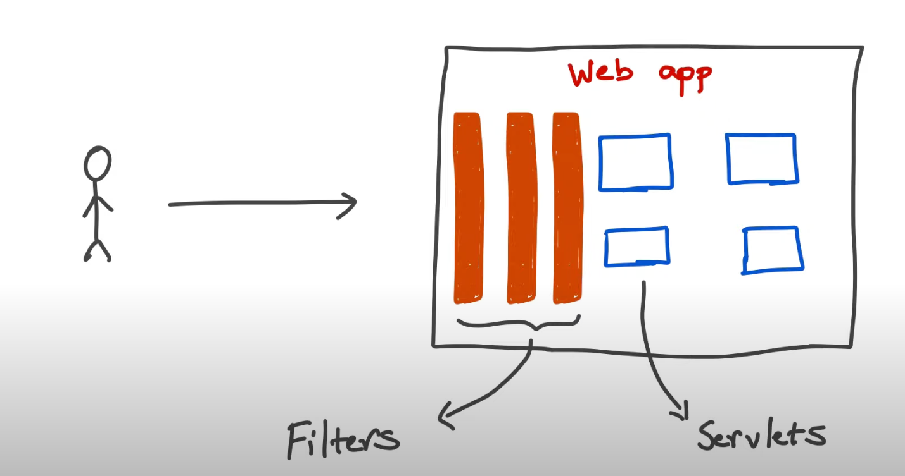
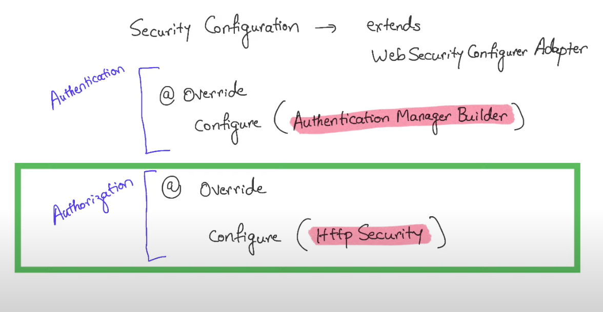
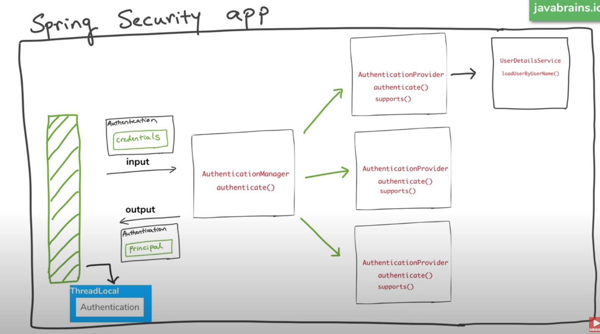
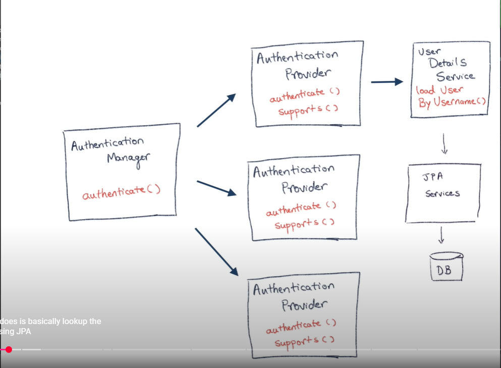

@SpringBootApplication

@SpringBootApplication annotation can be used to enable those three features, that is:
- @EnableAutoConfiguration: enable Spring Boot’s auto-configuration mechanism
- @ComponentScan: enable @Component scan on the package where the application is located (see the best practices)
- @Configuration: allow to register extra beans in the context or import additional configuration classes

The class with the main method creates Servlet container, starts it and hosts the application in it.

`SpringApplication.run`-
- Sets up default configuration.
- Starts Spring application context.
    - Spring is a container for all the code that runs on the application server.
    - This container is called ApplicationContext.
- Performs class path scan.
    - Scans through the application to understand the intent of the classes - controller, service, etc.
- Starts Tomcat server.
    - The Apache Tomcat is actually a server and a servlet container.

`Controller`- A Java class, marked with annotations which lets Spring know what is the URL it is mapping to and what
should happen when a request comes to that URL.

[Difference between @Controller and @RestController](https://www.geeksforgeeks.org/difference-between-controller-and-restcontroller-annotation-in-spring/):

- @Controller: returns HTML, JSON, XML, etc.
- @RestController: returns JSON, XML, etc.

`Service`- In Spring Business Services are Singleton (ensures only one instance of itself exists).

Bill of Materials - The preset list of possible combinations of jars that works well without issues.

[Spring Boot common application properties](https://docs.spring.io/spring-boot/appendix/application-properties/index.html).

Spring Data JPA -  lets you do Object Relational Mapping(ORM) when you are connected to a relational database.

----

[@Transactional annotation](https://www.geeksforgeeks.org/spring-boot-transaction-management-using-transactional-annotation/)
[Spring Boot Actuator](https://www.geeksforgeeks.org/spring-boot-actuator/)

----

Spring Reactive

Blocking programming model
Reactive model

----

Spring Security

All the OS, JVM, App level security are taken care of.
We are talking about Application level security. 
- Username/ password authentication
- SSO / Okta / LDAP
- App level authorisation
- Inta app authorisation like OAuth
- Microservice security (using tokens. JWT)
- Method level security

5 core concepts in Spring security:
1. Authentication
2. Authorisation
3. Principal
4. Granted Authority
5. Roles

---

1. Authentication: Who is this user?
   - Knowledge based authentication: password, pin code, secret question
   - Possession based authentication: phone/text messages, keycards and badges, access token device
   - Multifactor Authentication: 2FA - enter password and then verify your text message

2. Authorisation: Are they allowed to do this?
   - For authorisation, we need authentication first.

-[Difference between Authentication and Authorization](https://www.geeksforgeeks.org/difference-between-authentication-and-authorization/)

3. Principal: currently logged-in user/account
   - In google I have account A and B, if I am logged in as A then principal is A.

4. Granted Authority: way of providing authorisation.
   - permissions allowed to a given user.
   - Authorities are fine-grained.

5. Roles: group of authorities that are assigned together.
   - Store manager, dept. manager and clerks have certain authorities. Any new clerk comes based on roles we can 
     provide authorities
   - Roles are coarse-grained.

- [Difference between Roles & Granted Authority](https://www.geeksforgeeks.org/difference-between-role-and-grantedauthority-in-spring-security/)

- Servlets and Filters: Servlets are mapped to specific URLs while filters could be mapped to all URLs

- Spring Security default behaviour:
  1. Adds mandatory authentication for URLs.
  2. Adds login form.
  3. Handles login error.
  4. Creates a user and sets a default password.

- AuthenticationManager - manages authentication in a SpringBoot Security app. It has a method called `authenticate()`.
- @EnableWebSecurity - tells spring security that it is web security configuration.

- HttpSecurity - helps configure what are the paths and what are the access restrictions for those paths
 - for configuring authentication and authorisation.

- ### **How Spring Security Authentication works**

   
- Here we are looking Provider pattern

  - [Authentication](https://docs.spring.io/spring-security/site/docs/4.0.x/apidocs/org/springframework/security/core/Authentication.html) in Spring Security is an interface and its object act as a data transfer object. It takes the  
    credentials as input before authentication and returns the Principal (user data) as output.
  - [AuthenticationManager](https://docs.spring.io/spring-security/site/docs/current/api/org/springframework/security/authentication/AuthenticationManager.html) delegates the authentication to the AuthenticationProvider.
    - It calls the `supports` method provided by the AuthenticationProvider to check if the provider supports the authentication or not.
    - It returns an Authentication object after successful authentication or throws an authentication exception if the authentication fails.
  - [AuthenticationProvider](https://docs.spring.io/spring-security/site/docs/4.2.x/apidocs/org/springframework/security/authentication/AuthenticationProvider.html) is an interface which has a method called `authenticate()` responsible for authentication.
    - This AuthenticationProvider takes Authentication object as input with credentials as parameters and after 
      successful authentication returns Authentication object with authenticated user data known as Principal.
    - Each application can have multiple AuthenticationProvider, each one knowing how to authenticate (OAuth, SSO, LDAP)
    - They also have a method called `support()` which tells if the provider supports the authentication or not. (boolean)
  - UserDetailsService returns object of type [UserDetails](https://docs.spring.io/spring-security/site/docs/current/api/org/springframework/security/core/userdetails/UserDetails.html) which contains all the information about the user.
    - This UserDetails objects may be passed on as Principal once the user is authenticated.
  - Once successful authentication, the filter saves the Authentication object with the Principal details in the 
    SecurityContext which is associated with the current thread which is used to identify the current user.
  - There is another filter which is responsible for associating the authenticated principal with the user's session 
    so that we don't have to authenticate again and again in subsequent requests.

- 

    - Spring Security **JPA Authentication**  - here we create an instance of UserDetails Service and then Spring
      Security
      uses it for authentication

- Spring Security with LDAP (Lightweight Directory Access Protocol):
    - LDAP is a protocol for accessing and maintaining a directory information over a network. (ex: store organisational
      information)
    - Ex: organisation has managers, departments etc. and LDAP helps with user authentication and authorisation.
    - Spring security connects to LDAP server and uses LDAP to authenticate user and authorise them.
    - LDIF - LDAP Data Interchange Format